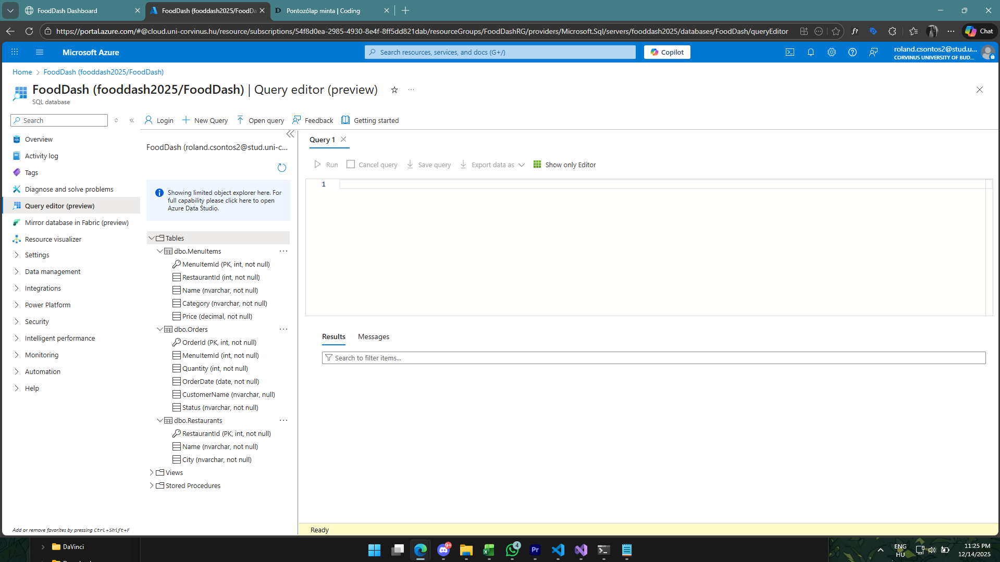
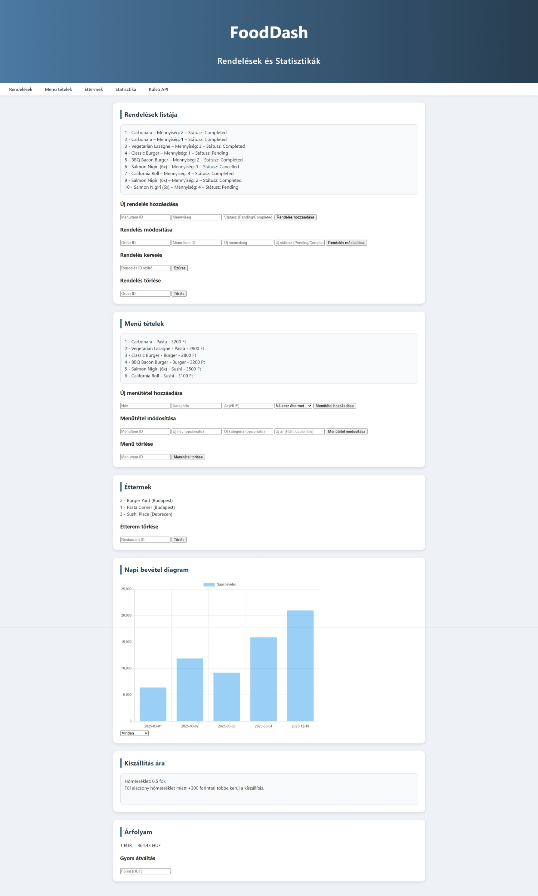
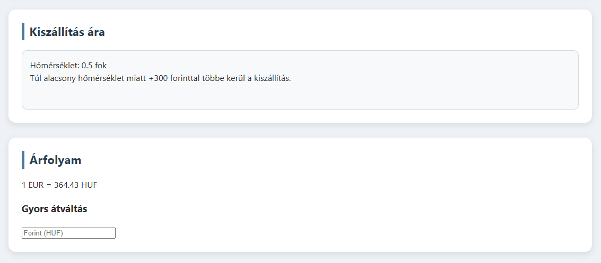
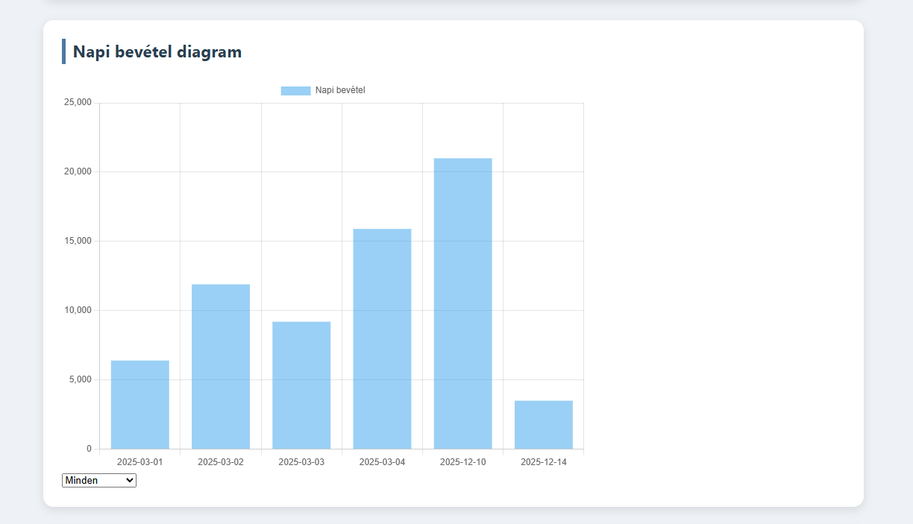

# Pontozólap
Név: Csontos Roland

Neptun: FJU9QR

## Projekt rövid leírása:
Egy egyszerű webapplikáció amely egy fiktív FoodDash nevű ételszállítással foglalkozó vállalat egyik belső manuális rendeléskezelő rendszere. A webapplikáció nem rendelkezik bejelentkező/regisztrációs lappal. Az `index.html` betöltésénél a backend lekér az `Azure`-ban lévő adatbázisból 3 táblát, melyekből a rendelések, ételek, és éttermek állnak rendelkezésre. A weboldal először betölti az elkészített API-kból az adatokat, melyek módosíthatóak, törölhetőek, szűrhetőek a kezelőfelületen, továbbá új adatokat is lehet rögzíteni. Ezen funkciók alatt található meg a "napi bevétel diagram", amely Chart.JS API-t használva rajzolja ki egy canvasra az adatokat szintén az API-n keresztül lekérve. Továbbá egy érdekes funkció a kiszállítás ára részen van, ahol a rendszer az ún. többletdíj/kényelmi díj prémiumját számítja ki az aktuális hőmérséklet alapján. Ez kizárólag akkor lép életbe ha a hőmérséklet 10 fok alatt, vagy 30 fok fölött van, és ekkor is a maximális értéke 300ft! Továbbá külföldi ügyfelek számára egy gyors euró átváltó is elhelyezésre került, amely nem a hivatalos, hanem a FoodDash által alkalmazott váltási áron vált át eurót. A FoodDash váltási ára pedig függ az aktuális árfolyamtól + a FoodDash euró -> forint átváltási díja.


## Hozott anyagok:

##### Saját Adatbázis


- `3x1p` Az alkalmazásban használt táblánként pont (Puzzles, Users, OpeningFamilies)
- `1p` Az adatbázis tartalmaz Constraint-eket (min 2)
- `2p` Az adatbázis saját Azure SQL szerveren van
- `1p` Az adatbázis adatainak forrásmegjelölése értsd: miből készült és hogyan:
>Az adatbázis szerkezetét és adatait a create_db.sql fájl megírásával és futtatásával hoztam létre az Azure-ban, a fooddash2025 nevű adatbázisba. A szkript manuálisan rögzített, fiktív tesztadatokat tartalmaz. Három táblája van: a Restaurants amely tartalmazza az éttermek neveit és városait. A MenuItems amely tartalmazza az ételeket és hogy azokat mely éttermek árusítját, továbbá milyen áron, kategóriában. Illetve az Orders tábla amely a rendeléseket tartalmazza: melyik ételt, hány adagot, a státusza stb. Ez a tábla összekötődik a menuItems táblával.

Részösszeg: `7p`

##### Weboldal



- `1p` A weboldalnak van egy értelmezhető struktúrája
- `1p` A weboldal dinamikus tartalommal tölthető fel adatbázison keresztül (dinamikus tartalom = API-n keresztül adatok hozzáadása, törlése, módosítása, továbbá kimutatások készítése.)
- `1p` A weboldal használ legalább 20 sor értelmes css-t
- `1p` A weboldal javascriptje más funkciót is ellát, mint az adatok betöltése (ErorrHandling függvény, továbbá különböző formázások)


Részösszeg: `4p`
Eddig: `11p`

### Egyéb, extra

- `2p`  Regex alkalmazása validáláson túl (hozott.js 49.sor, 60.sor)
- `1p`  `Scaffold-DbContext` használata

Részösszeg: `3p`
Eddig: `14p`

##### Bonyolultabb algoritmus használata értelmes feladatra

- `1p` Az algoritmus értelmes szerepet kap az alkalmazásban és nem lehet beépített megoldásokra kicserélni, nincs túlbonyolítva
```javascript
async function loadExternalApi() {
    try {
        const res = await fetch("https://api.open-meteo.com/v1/forecast?latitude=47.5&longitude=19.0&current_weather=true")
        if (!res.ok) {
            throw new Error("Hiba az időjárás API hívásakor")
        }
        const data = await res.json()
        const temp = data.current_weather?.temperature;

        const cont = el("externalApiContainer");
        clearChildren(cont);

        const tempDiv = createElement("div", "weatherRow", `Hőmérséklet: ${temp} fok`)
        cont.appendChild(tempDiv);

        let message = ""
        let extra = 0

        if (temp < 10) {
            extra = Math.round((10 - temp) * 100)
            extra = Math.min(Math.max(extra, 100), 300)
            message = `Túl alacsony hőmérséklet miatt +${extra} forinttal többe kerül a kiszállítás.`
        } else if (temp > 30) {
            extra = Math.round((temp - 30) * 100)
            extra = Math.min(Math.max(extra, 100), 300)
            message = `Túl magas hőmérséklet miatt +${extra} forinttal többe kerül a kiszállítás.`
        } else {
            message = "Alapáron történik a kiszállítás."
        }

        const plusDeliveryDiv = createElement("div", "plusDeliveryee", message)
        cont.appendChild(plusDeliveryDiv);
    } catch (err) {
        showApiError("Hőmérséklet API", "externalApiContainer", err)
    }
}
```
> itt az if(temp<10) el kezdődő logika

Részösszeg: `1p`
Eddig: `15p`

### ASP .NET 

- `2p`  `program.cs` beállítása `wwwroot` mappában tárolt statikus tartalmak megosztására

Részösszeg: `2p`
Eddig: `17p`

##### API végpontok


- `3p` Teljes SQL tábla adatainak szolgáltatása API végponton keresztül (openings)
- `3p` SQL tábla egy választható rekordjának törlése (deleteOrder,  A deleteMenuItem, és deleteRestaurant NEM MŰKÖDIK)
- `5p` Új rekord felvétele `HttpPost` metóduson keresztül SQL táblába (addOrder, addMenuItem)
- `2x3p` Rekord módosítása `HttpPost` metóduson keresztül SQL táblában (editOrder, editMenuItem)
- `2x5p` Külső API végpont használata JS kódban, itt: [Hőmérséklet lekérése](https://api.open-meteo.com/v1/forecast?latitude=47.5&longitude=19.0&current_weather=true),[Aktuális forint Euró árfolyam lekérése](https://api.frankfurter.app/latest?from=EUR&to=HUF)


Részösszeg: `27p`
Eddig: `44p`

##### Diagram rajzolása

- `1x5p` Tetszőleges diagram rajzolása. A Froms-ból kivették a Chart controlt, de pl. a https://www.chartjs.org/ használható JS alapú diagramok készítésére.
>A szűrési funkció jelen van a diagram alatt azonban NEM MŰKÖDIK!!!

Részösszeg: `5p`
Eddig: `49p`


## Összessen: `61p`